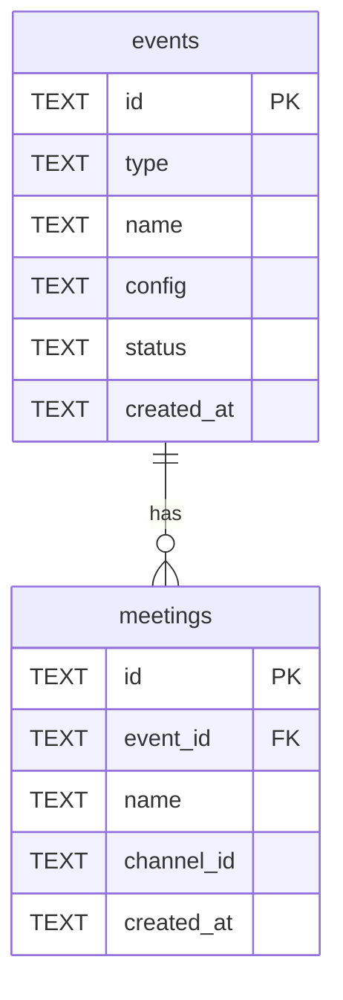

# ADR-0001: イベントモデルの導入

- Status: Proposed
- Date: 2026-04-29

## Context

本プロダクトは「リーダー雑談会（13人の技術リーダーによる月次集会）」専用の Slack ボットとして発足し、現在の DB スキーマも単一目的を前提に組まれている。具体的には、`meetings` がトップレベルのエンティティであり、運営対象（リーダー雑談会）が暗黙的に固定されている。

しかし、運営団体「Developers Hub」では年次ハッカソン「HackIt（4回目）」など、性質の異なるイベントを同じ運営チーム・同じ Slack ワークスペースで管理する必要が出てきた。プロダクト名も `leaders-meetup-bot` から `DevHub Ops` に改称し、複数イベント対応プラットフォームへ転換する。

現状の単一目的構造のままでは、以下の問題がある。

- HackIt のような別種イベントを追加するたびにテーブルやコードを横並びに増やすことになり、関心の分離が崩れる。
- 「今操作しているのはどのイベントか」を識別する一級概念が無いため、Slack コマンドや UI の文脈切り替えが困難。
- イベント固有の設定（候補日生成ルール、応募締切ロジック、賞金枠など）を保持する場所が無い。
- イベントのライフサイクル（準備中／開催中／アーカイブ済み）を表現する手段が無い。

これらの課題を解決するため、`events` を新たなトップレベルエンティティとして導入する。

## Decision

以下を決定する。

1. `events` テーブルを新設し、プラットフォーム上で扱うすべてのイベント（リーダー雑談会、HackIt、将来追加するもの）を一元管理する。
2. `meetings` テーブルに `event_id`（FK → `events.id`）を追加し、すべての meeting が必ず特定の event に従属する構造とする。
3. イベント種別は `events.type` の discriminator（`'meetup' | 'hackathon'`、将来拡張可）で表現する。type 固有の設定は `events.config`（JSON 文字列）に格納し、スキーマ分岐を避ける。
4. イベントのライフサイクルは `events.status`（`'active' | 'archived'`）で表現する。

### スキーマ仕様

`events` テーブル（新設）

| 列 | 型 | 制約 | 説明 |
|---|---|---|---|
| id | TEXT | PRIMARY KEY | UUID |
| type | TEXT | NOT NULL | `'meetup'` / `'hackathon'`（将来拡張可） |
| name | TEXT | NOT NULL | 表示名（例: "リーダー雑談会", "HackIt 2026"） |
| config | TEXT | NOT NULL DEFAULT `'{}'` | type 固有設定の JSON 文字列 |
| status | TEXT | NOT NULL DEFAULT `'active'` | `'active'` / `'archived'` |
| created_at | TEXT | NOT NULL | JST ISO 8601 文字列 |

`meetings` テーブル（変更）

- `event_id: TEXT NOT NULL` を追加（FK → `events.id`）
- 既存レコードは ADR-0005 で定めるデータ移行で「default meetup event」へ紐付ける

### ER図

## Alternatives Considered

### 案A: `meetings` テーブルに `use_for` 列を追加して分岐

`meetings` テーブルに `use_for: 'meetup' | 'hackathon'` 列を足し、用途で挙動を分岐させる案。

不採用理由:

- `meetings` という名前のエンティティが、本来 meeting ではない HackIt（数ヶ月続くハッカソン）まで保持することになり、意味論が破綻する。
- type 固有設定を持つ場所が無く、列を増やす／NULL 許容で逃げるなどスキーマ分岐が悪化する。
- イベントそのもののメタ情報（status、created_at 等）を保持できず、ライフサイクル管理が不可能。

### 案B: イベントごとに別 Worker をデプロイ

リーダー雑談会用 Worker と HackIt 用 Worker をそれぞれ独立してデプロイする案。

不採用理由:

- Cloudflare Workers / D1 / Slack 連携設定を複製する運用負担が大きい。
- Slack 認証・ユーザー管理・通知処理など共通機能を二重に実装・保守することになる。
- 横断的な参照（例: 「今月の Developers Hub のイベント一覧」）が物理的に分断され困難。

### 案C（採用）: `events` テーブル + `type` discriminator + JSON `config`

採用理由:

- 1 つのトップレベル概念で複数イベントを一元管理できる。
- type 固有のロジックは TypeScript 側で discriminated union で型安全に分岐でき、UI/API も type 別に実装が容易。
- 設定は JSON `config` に閉じ込めることで、type 追加時に DDL 変更が不要。
- D1（SQLite）でも JSON 文字列で十分扱え、将来 PostgreSQL へ移行する際も `JSONB` へ素直にマッピングできる。

## Consequences

### 良い点

- **拡張性**: 新イベント種別の追加が `type` 値の追加と JSON `config` のスキーマ追加だけで済み、テーブル増殖を避けられる。
- **関心の分離**: イベント自体のライフサイクル（events）と各回の運営状態（meetings）が明確に分かれる。
- **UI/API の素直な実装**: クライアントは `event_id` を文脈として持ち、type に応じた画面・エンドポイントを切り替えられる（ADR-0003 で詳細化）。
- **横断クエリ**: 「Developers Hub の active なイベント一覧」のような横断的な参照が単一クエリで可能。

### 悪い点

- **マイグレーションが必要**: `events` テーブル新設、`meetings.event_id` 追加、既存データの紐付けが必要（ADR-0005 で詳細化）。
- **API/UI に `event_id` 必須化**: 既存の API・Slack コマンド・UI 画面に `event_id` の伝搬が必要となり、影響範囲が広い。
- **既存のリーダー雑談会の無停止移行**: 運用中のため、本番投入時にダウンタイム無しで既存 meetings を default event に紐付ける必要がある。

### 他 ADR への影響

- **ADR-0002（タスク管理）**: HackIt 等で発生するタスクは event に紐付くため、`tasks.event_id` 設計はこの ADR を前提とする。
- **ADR-0003（UI スイッチャー）**: 画面上部にイベント切替 UI を配置し、選択中の `event_id` をフロント全体の文脈として持たせる。
- **ADR-0005（データ移行）**: 既存 meetings レコードを default meetup event に紐付ける具体的な migration 手順をこの ADR の決定に基づき設計する。
