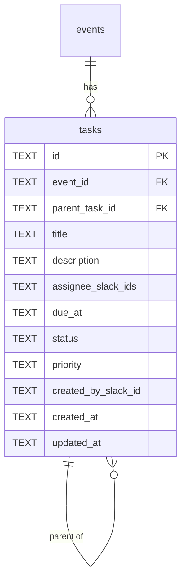

# ADR-0002: タスク管理機能の設計

- Status: Proposed
- Date: 2026-04-29

## Context

Developers Hub の年次ハッカソン **HackIt** では、運営チーム（少人数）が「会場確保」「スポンサー対応」「告知」「当日運営」など多数の運営タスクを抱える。現状は Slack の口頭・スレッドで管理しており、抜け漏れや担当不明、進捗の不可視性が発生している。

DevHub Ops は ADR-0001 で `events` テーブルを導入し、meetup / hackathon を統一的に扱う基盤を持つ。HackIt 運営タスク管理を **DevHub Ops の標準機能** として組み込むことで以下の利点がある:

- Slack / Web の二系統 UI を既存基盤（Hono + React 19 + Slack Bolt 互換 Worker）で再利用できる
- リマインドは既存 `scheduled_jobs` を再利用でき、新規スケジューラ実装が不要
- 認証・運営メンバー管理・通知チャンネル設定が events.config と統合される
- Developers Hub の他イベント（将来の勉強会や輪読会）にも転用しやすい

外部ツール（Notion / ClickUp 等）連携も検討したが、Slack コマンド統合・運営メンバー権限・既存基盤との結合度を考えると、自作が妥当と判断した（Alternatives 参照）。

対象は **運営チーム内タスク** であり、参加者向けタスクではない。

## Decision

`tasks` テーブルを新設し、`events.id` に紐付ける。**1階層のサブタスク**を採用、`assignee_slack_ids` は JSON 配列で複数担当に対応する。Slack（スラッシュコマンド + モーダル + DM 通知）と Web UI（一覧 + フィルタ）の両方からアクセス可能とする。リマインドは既存 `scheduled_jobs` を再利用し、`due_at` の前日 / 当日 9:00 JST に Slack DM を送る。

### tasks スキーマ

| カラム | 型 | 制約 | 説明 |
|---|---|---|---|
| id | TEXT | PK (UUID) | タスクID |
| event_id | TEXT | NOT NULL, FK → events.id | 紐付くイベント |
| parent_task_id | TEXT | FK → tasks.id, NULL可 | 親タスク（**1階層のみ**、アプリ層で深さ強制） |
| title | TEXT | NOT NULL | タイトル |
| description | TEXT | NULL可 | 詳細 |
| assignee_slack_ids | TEXT | NOT NULL DEFAULT '[]' | Slack user ID の JSON 配列 |
| due_at | TEXT | NULL可 | JST ISO 文字列 |
| status | TEXT | NOT NULL DEFAULT 'todo' | 'todo' / 'doing' / 'done' |
| priority | TEXT | NOT NULL DEFAULT 'mid' | 'low' / 'mid' / 'high' |
| created_by_slack_id | TEXT | NOT NULL | 作成者 Slack ID |
| created_at | TEXT | NOT NULL | JST ISO |
| updated_at | TEXT | NOT NULL | JST ISO |

インデックス: `(event_id, status)`, `(event_id, due_at)`, `(parent_task_id)` を想定。

### ER図

### Slack インタラクション

| コマンド | 挙動 |
|---|---|
| `/devhub task add` | モーダルを開き、タイトル / 担当（複数選択）/ 期限 / 優先度 / 親タスク（任意）を入力して作成 |
| `/devhub task list [filter]` | 自分が担当のタスク一覧をエフェメラルで表示。`status:doing` 等の簡易フィルタ可 |
| `/devhub task done <id>` | 該当タスクを status=done に更新 |

通知:

- 担当者にアサインされた瞬間に Slack DM
- `due_at` の **前日 9:00 JST** と **当日 9:00 JST** に Slack DM（`scheduled_jobs` を再利用）

### Web UI フィルタ

一覧画面で以下を組み合わせ可能:

- status（todo / doing / done の複数選択）
- assignee（Slack ユーザー複数選択）
- due_at 範囲（from / to）
- priority（low / mid / high の複数選択）
- 表示モード切替: **親タスクのみ** / **子タスクも展開**

子タスク展開時はインデント表示し、親タスクの進捗バー（子の done 比率）を併記する。空状態には「タスクを追加」CTA を置く。

## Alternatives Considered

- **案A: 多階層サブタスク** — 採用しない。UI が複雑化し、再帰クエリ（CTE）コストも増える。HackIt 運営タスクの粒度では2階層で十分。
- **案B: サブタスクなし完全フラット** — 採用しない。「会場確保 → 候補リストアップ / 視察 / 契約」のような分解ニーズが運営から実際に出ている。
- **案C（採用）: 1階層サブタスク** — UI のシンプルさと分解ニーズのバランスが取れる。アプリ層で `parent_task_id IS NOT NULL のタスクは parent_task_id を持てない` を強制する。
- **案D: 外部ツール（Notion / ClickUp）連携** — 採用しない。Slack コマンド統合の手間、運営メンバー権限の二重管理、DevHub Ops 統合価値の希薄化が問題。

## Consequences

### 良い点

- 運営チームのタスク状況が Slack / Web 両方で可視化される
- 既存の `scheduled_jobs` 基盤を流用するためリマインド実装コストが小さい
- events への外部キーで将来の他イベント（勉強会等）にも自然に拡張できる
- 1階層制約により UI とクエリがシンプルに保たれる

### 悪い点 / リスク

- 新規 Slack コマンド・モーダル・DM 通知の実装コスト（中規模）
- フィルタ UI（特に複数選択 + 範囲 + 親子切替）の実装コスト
- 1階層制約・status 遷移ルール（todo→doing→done のみ等）は **アプリ層で保証** が必要。DB 制約だけでは担保できない
- `assignee_slack_ids` が JSON 配列のため、担当者でのフィルタは LIKE 検索になり大量データ時の性能注意（HackIt 規模では問題ない想定）

### 依存

- ADR-0001（events テーブル）に依存
- ADR-0003（UI スイッチャー）で hackathon タブ配下にタスク管理画面を表示する予定
