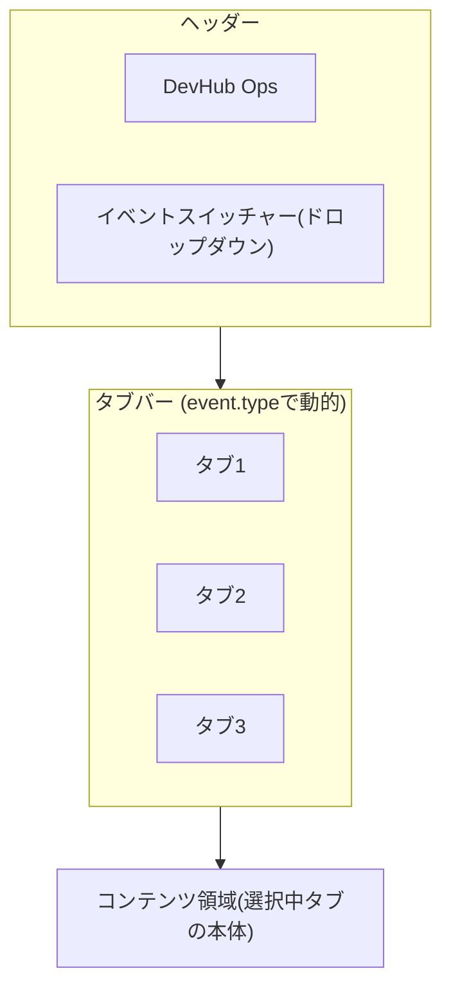

# ADR-0003: UIイベントスイッチャー + event type 別タブ構成

Status: Accepted
Date: 2026-04-29

## Context

DevHub Ops（旧 leaders-meetup-bot）の Web UI は、現在「リーダー雑談会」という単一ミーティング前提で固定されており、タブ構成も「メンバー / スケジュール / 履歴」の3つで決め打ちになっている。

しかし ADR-0001 で events テーブルを導入し、`type: 'meetup' | 'hackathon'` の複数イベントを扱う方針が確定した。さらに ADR-0002 で hackathon 向けに tasks テーブルも追加された。これに伴い、UI 側でも以下を満たす必要がある:

- 複数の event を切り替えて閲覧・操作できる
- event の種類によって必要なタブが異なる（meetup は「スケジュール」が要る、hackathon は「タスク」が要る）
- リロードしても同じ event を見続けられる
- URL から特定 event の特定タブに直接アクセスできる（ディープリンク）
- 将来 `type` が増えても破綻しない構造にする

現状の固定 UI のままでは複数 event 対応ができないため、UI 構造の方針を決定する。

## Decision

### 1. ヘッダー右側にイベントスイッチャー（ドロップダウン）を配置

Slack のワークスペース Switcher に類似した、ヘッダー右側のドロップダウン UI で event を切り替える。クリックで event 一覧が展開し、選択すると即時切替する。

### 2. タブ構成は `event.type` で動的に決定

選択中 event の `type` に応じてタブを出し分ける。

| event.type | 表示タブ（左から順） |
|---|---|
| meetup | メンバー / スケジュール / 履歴 |
| hackathon | タスク / メンバー / 履歴 |

タブ slug は URL でも使う:

| タブ | slug |
|---|---|
| メンバー | `members` |
| スケジュール | `schedule` |
| 履歴 | `history` |
| タスク | `tasks` |

### 3. 選択状態は localStorage に保持

- キー: `devhub_ops:current_event_id`
- 値: 選択中 event の UUID
- 起動時に読み出し、URL の `:eventId` が無い場合のフォールバックに使う

### 4. URL ルーティングは `/events/:eventId/:tab` 形式

- 例: `/events/abc-123/members`、`/events/xyz-789/tasks`
- ルート `/` にアクセス時は localStorage から復元、無ければ最初の event の既定タブへ
- `:tab` が `event.type` と整合しない場合（meetup なのに `tasks` 等）はその type の既定タブへリダイレクト
- 各 type の既定タブ: meetup → `members`、hackathon → `tasks`

### 5. Event 新規作成は別画面 or ダイアログ（本 ADR では UI 詳細は決めない）

スイッチャー末尾に「+ 新規イベント作成」を置く方針のみ確定。具体的なフォーム UI は別 ADR / 実装で扱う。

### 6. Event 未選択時の空状態 UI

events が 0 件のときは「最初のイベントを作成しましょう」という空状態画面を表示する。

## UI 構成図



```
+----------------------------------------------------------+
| DevHub Ops                          [Leaders Meetup ▼]   |  ← Header + Switcher
+----------------------------------------------------------+
| メンバー | スケジュール | 履歴                            |  ← Tabs (type=meetup の場合)
+----------------------------------------------------------+
|                                                          |
|   コンテンツ領域 (URL: /events/:eventId/:tab)            |
|                                                          |
+----------------------------------------------------------+
```

## Alternatives Considered

### 案A: 左サイドバーにイベント一覧（不採用）
- 縦スペースを消費し、モバイルで邪魔になる
- 想定 event 数は少数（数件〜十数件）であり、サイドバー常設はオーバースペック

### 案B: トップレベルルートで分離（`/leaders`, `/hackit`）（不採用）
- ハードコード前提なので動的な event 追加に対応できない
- type ごとに URL 命名が分かれて一貫性が崩れる

### 案C: ヘッダードロップダウン + URL `/events/:eventId/:tab`（採用）
- 拡張性、ディープリンク、状態保持、認知負荷の低さがバランス良い
- event ID が URL に出るので共有・ブックマークが安定する

### 案D: タブを全部表示し非該当を disabled で隠す（不採用）
- 何が使えるのかが直感的に分からず認知負荷が増える
- type が増えるたびに全タブが膨張する

## Consequences

### 良い点
- 新しい `event.type` が増えても、タブマッピング表に1行追加するだけで対応できる（拡張性）
- URL に event ID とタブが入るのでディープリンク・共有・ブックマークが可能
- localStorage により再訪問時に直前のコンテキストへ即復帰できる
- 表示中タブが常に「その event で意味のあるタブ」だけになり、認知負荷が低い

### 悪い点 / トレードオフ
- 既存の URL 構造（タブ直下）を変更するため、既存ブックマークは失効する
- ルーター設計をやり直す必要がある（React Router の構造変更）
- events が 0 件のときの空状態 UI を新たに設計・実装する必要がある
- localStorage と URL の両方が状態源になるため、両者の整合ロジック（URL 優先、無ければ localStorage、それも無ければ既定）を明確に保つ必要がある

### 依存関係
- ADR-0001（events テーブル）に依存: event 一覧・type 取得が前提
- ADR-0002（tasks テーブル）に依存: hackathon タブ「タスク」の対象データ
