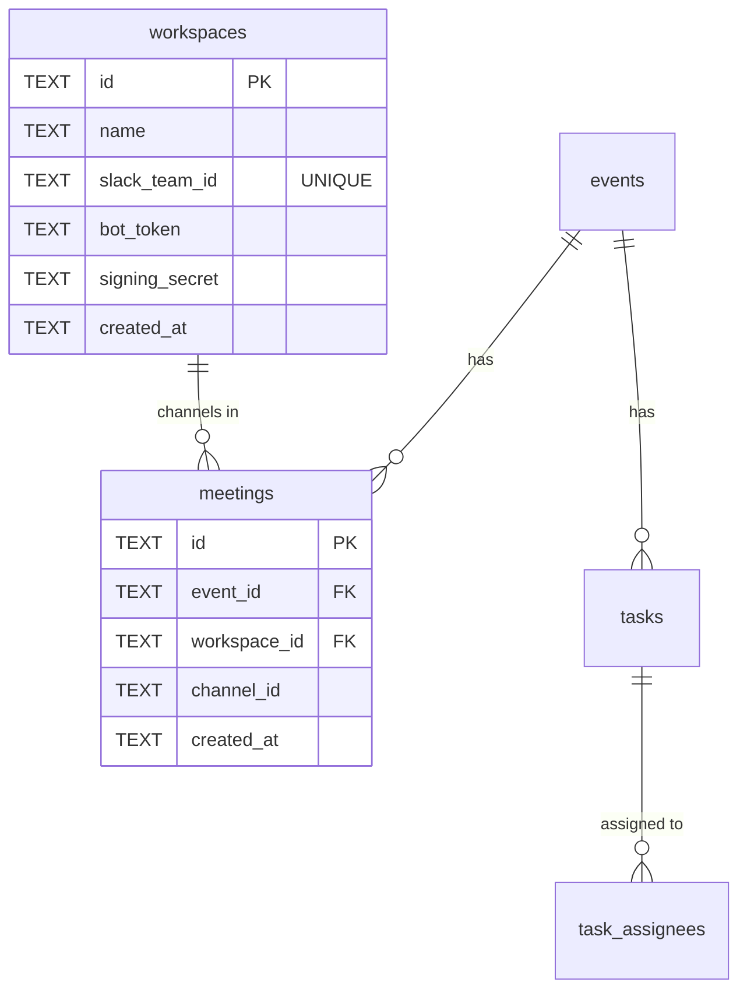

# ADR-0006: マルチワークスペース対応 + sticky tasks bot

- Status: Proposed
- Date: 2026-04-29

## Context

現在の DevHub Ops は単一 `SLACK_BOT_TOKEN` で動作し、Developers Hub workspace のみ対応している。
HackIt（年次ハッカソン）は別の Slack workspace で運営されているが、一部チャンネル（運営チーム情報共有用など）は Developers Hub WS にも存在しており、両 WS のタスクを一元管理したい要望がある。さらに、リーダー雑談会 event からも HackIt WS のチャンネルへアクセスでき、相互参照できる構成が求められる。

加えて、HackIt 運営チームから次の UX 要望が出ている。

- スラッシュコマンドではなく **常にチャンネル最下部にタスク一覧を表示する sticky bot** にしたい。
- 担当者ボタン・完了ボタン・新規作成ボタンを直接押せるようにしたい。
- 100 人規模のチャンネルでも通知音で運営を妨げない設計にしたい。

これらを満たすため、データモデル・Slack API 認証・UX を同時に拡張する必要がある。

## Decision

### 1. workspaces を新規トップレベルエンティティに

| 列 | 型 | 説明 |
|---|---|---|
| id | TEXT PK | UUID |
| name | TEXT NOT NULL | 表示名（"Developers Hub" / "HackIt" 等） |
| slack_team_id | TEXT NOT NULL UNIQUE | Slack の `team_id`（`T...`） |
| bot_token | TEXT NOT NULL | `xoxb-...` **(encrypted)** |
| signing_secret | TEXT NOT NULL | Slack App の Signing Secret **(encrypted)** |
| created_at | TEXT NOT NULL | UTC ISO 文字列 |

### 暗号化保存

- **暗号化方式**: AES-256-GCM (Web Crypto API、Cloudflare Workers でネイティブサポート)
- **マスターキー**: 環境変数 `WORKSPACE_TOKEN_KEY` (32 bytes Base64) を Wrangler secrets で管理
- **保存形式**: `{iv}:{ciphertext}:{tag}` Base64 結合形式
- **key rotation**: 将来課題として、ローテーションは新キーで再暗号化マイグレーション + 旧キーを一定期間並走させる方式を残置
- **decrypt のタイミング**: Slack API 呼び出し直前にメモリ展開し、永続化やログ出力はしない

### 2. meetings に workspace_id 追加

ADR-0005 と同様、**NULL 許容で追加し `.notNull()` は使わない**。既存全件は default workspace（Developers Hub WS = 既存 `SLACK_BOT_TOKEN` を起点とする行）にバックフィル。

### 3. tasks に start_at 追加

NULL 許容、UTC ISO 文字列。タスクの開始日を表す。`due_at` は引き続き締切。

### 4. events と workspaces の関係

events は workspace に縛られない。**events から任意の workspace のチャンネルへアクセス可能** とする。
event の channel（meeting）が `workspace_id` を持ち、Slack API 呼び出し時はその workspace の token を使う。

### ER 図 (Mermaid)

### 5. Webhook 署名検証のマルチ WS 対応

try-all 方式は登録 WS 数に比例して計算量が増え、DoS / timing attack のリスクがあるため不採用。
代わりに **生 body から team_id を先に抽出 → 該当 WS のみで HMAC 検証** する方式を採る。

- **Step 1**: 生 body 文字列から最小限の JSON パースで `team_id` を抽出。
  - スラッシュコマンド / インタラクションは form-encoded のため、`payload` キーを `JSON.parse` してから `team.id` を読む。
  - イベント API (`/slack/events`) は body 自体が JSON。
- **Step 2**: 抽出した `team_id` で `workspaces WHERE slack_team_id = ?` を検索。
- **Step 3**: 該当 WS の `signing_secret`（復号後）で HMAC-SHA256 検証を **1 回のみ** 実行。
- **Step 4**: 検証成功後に初めて payload を信頼し、後続処理へ受け渡す。

注記:
- team_id 抽出は **ルーティング目的のみ**。署名検証前なので payload の他の値は信用しない。
- team_id が登録済み workspaces にない場合は **401 を即返却**。
- これにより try-all 方式の DoS リスク・timing attack を解消できる。

### 6. Sticky tasks bot 設計

| 項目 | 設計 |
|---|---|
| 配置 | meeting に紐付くチャンネルへ「タスクボード」 bot メッセージを post し、そのメッセージ ts を `meetings.task_board_ts` として保存 |
| 再 post トリガー | チャンネルへの `message` event 受信時 |
| デバウンス | 10 秒以内に再 post 済みならスキップ。`scheduled_jobs` に `sticky_repost` タイプを積んで遅延処理 |
| bot 自身のメッセージ無視 | event の `bot_id` で判定（既存パターン流用） |
| 通知抑制 | `text` フィールドはほぼ空にし、内容は `blocks` へ。Slack ユーザー名はプレーンテキストで表示し `@メンション` を使わない → 通知音抑制 |
| 担当ボタン | `block_actions` `sticky_assign_:taskId` でトグル（既にアサイン済みなら解除） |
| 完了ボタン | `block_actions` `sticky_done_:taskId` で `status='done'` |
| 新規作成ボタン | `block_actions` `sticky_create` でモーダル開く（既存 PR47 の TaskFormModal Slack 版を流用） |

### 7. Web UI ワークスペース登録画面

- `/workspaces` 画面（新規ルート）
- 一覧表示 + 新規追加フォーム（`name` / `slack_team_id` / `bot_token` / `signing_secret` 入力）
- `bot_token` と `signing_secret` は機微情報のため Web UI から登録 → DB 保存
- 編集・削除も可能。削除時に紐付く meetings の挙動（カスケード or 拒否）は実装時に決定。

### 8. 既存 `/devhub task add/list` は温存

削除コスト > 残しておく害なし。sticky bot と並存させる。

### 9. データ移行（ADR-0005 と同方針）

- **Step 1**: `workspaces` テーブル作成、`meetings.workspace_id` 追加（NULL 許容）、`tasks.start_at` 追加。
- **Step 2**: 既存 `SLACK_BOT_TOKEN` / `SLACK_SIGNING_SECRET` から default workspace 行を `INSERT OR IGNORE` で投入。
- **Step 3**: 全 meetings の `workspace_id` を default workspace ID に `UPDATE`。
- **Step 4**: アプリ層で `workspace_id` 必須化（Zod 等のランタイム検証）。DB 制約は付けない。

## Alternatives Considered

- **案 A**: `events.config` JSON に bot_token を保存。
  - 不採用: event は WS に縛られない要件と矛盾、token を event ごとに重複保持するコスト。
- **案 B**: Slack OAuth を完全実装（multi-tenant SaaS パターン）。
  - 不採用: 運用 WS が 3〜4 件想定では過剰。手動登録で十分。
- **案 C**: workspace ごとに別 Worker をデプロイ。
  - 不採用: 運用負担が高く、events 横断のクエリが難しくなる。
- **案 D（採用）**: `workspaces` 共有テーブル + `meetings.workspace_id`。

## Consequences

### 良い点

- events が WS に縛られず柔軟に複数 WS のチャンネルを束ねられる。
- 新 WS 追加が Web UI から可能で、運営者が自走できる。
- 100 人規模 channel への通知抑制設計が組み込まれる。
- 既存 `SLACK_BOT_TOKEN` は default WS 化で無停止移行可能。

### 悪い点

- workspaces 管理画面の実装コストが追加で発生する。
- マスターキー (`WORKSPACE_TOKEN_KEY`) を紛失すると bot_token / signing_secret が復号不能となり、全 WS 再登録が必要。
- sticky bot は rate limit との相性が悪く、10 秒デバウンス + bot 自身無視を必ず守る必要がある。
- 移行完了後 (Step 6) で物理制約を追加し、長期的なデータ整合性を保証する（中間期間はアプリ層検証に依存）。

### 影響を受ける ADR / 既存実装

- ADR-0001: events モデル（変更なし、影響なし）。
- ADR-0002: tasks（`start_at` 追加で拡張）。
- ADR-0005: マイグレーション戦略（同方針を流用）。
- 既存 `SlackClient`: workspace 引数を受け取る形にリファクタリング必要。

## Migration plan summary

| Step | Migration / Code | Risk | Rollback |
|---|---|---|---|
| 1 | `CREATE TABLE workspaces`; `ALTER TABLE meetings ADD workspace_id`; `ALTER TABLE tasks ADD start_at` | 低 | `DROP` / `ADD COLUMN` を取り消す migration |
| 2 | `INSERT OR IGNORE` default workspace using env tokens | 低 | `DELETE WHERE id='ws_default'` |
| 3 | `UPDATE meetings SET workspace_id=default` | 中 | `UPDATE` で NULL に戻す（冪等） |
| 4 | アプリ層: `SlackClient` マルチ WS 対応、webhook 署名検証は team_id 抽出 → 該当 WS のみで HMAC | 中 | feature flag で切替 |
| 5 | Sticky bot 機能追加 | 中 | feature flag で切替 |
| 6 | **メンテナンス window 後**: meetings / tasks / workspaces 各テーブル再作成 (CREATE → COPY → DROP → RENAME) で NOT NULL + FOREIGN KEY 制約を追加 | 中（メンテ window 必要、テーブル再作成のため D1 サイズに注意） | 旧テーブルからコピーで戻す |
