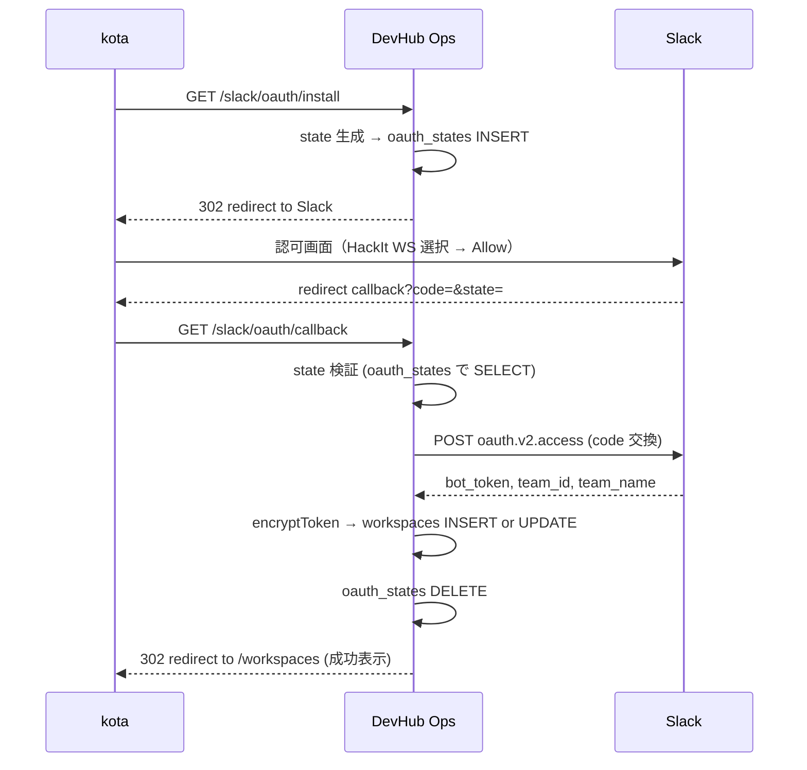

# ADR-0007: Slack OAuth による multi-install 対応

- Status: Proposed
- Date: 2026-04-30

## Context

ADR-0006 で workspaces 登録制を実装したが、運用上、各ワークスペース用に
**別々の Slack App を作成する**負担がある:

- App ごとに scope 設定 / Request URL 設定 / 配布設定が必要
- scope を変更したいときに全 App に同じ変更を適用する手間
- 内部 App は他ワークスペースにインストールできない仕様

そこで、既存の Slack App を **Distributable** 化し、**OAuth v2 install フロー**を
DevHub Ops に実装することで、1 つの App から複数 workspace へのインストールを
ユーザーが UI 操作だけで完結できるようにする。

## Decision

### 1. OAuth v2 フロー導入

| エンドポイント | 役割 |
|---|---|
| `GET /slack/oauth/install` | state 生成・保存 → Slack の認可URL に 302 リダイレクト |
| `GET /slack/oauth/callback?code=...&state=...` | state 検証 → `oauth.v2.access` で bot_token / team_id 取得 → workspaces に INSERT or UPDATE |

### 2. state による CSRF 防止

- install 開始時にランダム state（UUID v4）を生成し D1 の `oauth_states` テーブルに短期保存（TTL 10分）
- callback で受け取った state を一致確認、未知 or 期限切れなら 400
- 検証成功時は **即削除（one-time use）** することで replay を防止

### 3. signing_secret の扱い

- OAuth でインストールされた workspaces は **App 共通の signing_secret** を使う（同一 App なら全 install 共通）
- env `SLACK_SIGNING_SECRET` を使うことも可能だが、後方互換のため **workspaces.signing_secret に同じ値を暗号化複製**（既存手動登録パターンと統一）
- 将来 multi-App 対応を考えると workspaces.signing_secret の per-workspace 保存は維持価値がある

### 4. 重複インストール対応

- callback で `slack_team_id` を既存 workspaces から検索
- 既存があれば **bot_token を UPDATE**（再インストール扱い）
- なければ **INSERT**（新規登録）
- 結果として、ユーザーが間違って再インストールしてもデータ破損なし

### 5. 必要な環境変数（追加）

- `SLACK_CLIENT_ID`: OAuth アプリの Client ID
- `SLACK_CLIENT_SECRET`: OAuth アプリの Client Secret（Wrangler secret として登録）
- `OAUTH_REDIRECT_URL`: コールバック URL（例: `https://<your-worker-domain>/slack/oauth/callback`、実際の URL は本番デプロイ先に合わせる）

### 6. UI 統合

`/workspaces` ページに以下を追加:

- 「Slack でインストール」ボタン（リダイレクト方式 → `/slack/oauth/install` へ GET）
- 既存の手動 Bot Token 入力フォームは **fallback として温存**（OAuth が使えない場合の緊急対応）

### 7. スキーマ追加

`oauth_states` テーブル:

| 列 | 型 | 説明 |
|---|---|---|
| state | TEXT PK | UUID v4 |
| created_at | TEXT NOT NULL | UTC ISO |
| expires_at | TEXT NOT NULL | UTC ISO（created_at + 10分） |

簡易実装なら scheduled_jobs を流用 or 単に短期 JWT で signed state を発行も可。
本ADRでは **新規 oauth_states テーブル**を採用（UNIQUE PK で再利用防止が明示的）。

### 8. oauth_states の期限切れレコードクリーンアップ

D1 には自動 TTL 機能がないため、`expires_at < NOW()` のレコードは放置すると蓄積する。
以下のいずれかで定期削除する:

| 案 | 内容 | 推奨度 |
|---|---|---|
| **A（推奨）** | 既存 cron (5分間隔) の `processScheduledJobs` フローに `cleanupExpiredOauthStates()` を1行追加 | 既存基盤再利用、追加コスト最小 |
| B | `scheduled_jobs` に `oauth_state_cleanup` タイプを定期登録、Worker が処理 | 過剰、cron で十分 |
| C | install / callback 各呼び出しで都度 expired を delete | リクエスト遅延、推奨しない |

採用: **案A**。`src/services/scheduler.ts` の cron ハンドラに以下のような数行を追加:

```typescript
// oauth_states の期限切れ削除（5分ごとに実行される cron で十分）
await db.delete(oauthStates).where(lt(oauthStates.expiresAt, new Date().toISOString()));
```

### シーケンス図 (Mermaid)



## Alternatives Considered

- **案A**: 別 Slack App を作成（既存 ADR-0006 の手動登録運用）
  - 不採用: scope 変更時に全 App 修正が必要、運用負荷が高い
- **案B（採用）**: OAuth v2 で 1 App を multi-workspace install
- **案C**: 短期 JWT signed state（DBなし）
  - 不採用: 実装はやや複雑、replay 防止に追加対策必要、DB の方が明示的
- **案D**: 完全な Slack OAuth + token rotation 対応
  - 不採用: 過剰、bot_token の rotation は当面不要

## Consequences

### 良い点

- 1 Slack App で複数 WS 対応、scope 変更が1箇所で済む
- ユーザーは UI ボタンクリックで完結、Token 手動コピペ不要
- 重複 install 時の自動更新で破綻しない
- 既存手動登録フォームと共存可能

### 悪い点

- OAuth callback 実装 + state 管理コード（~150行）増
- env vars 2つ追加（SLACK_CLIENT_ID, SLACK_CLIENT_SECRET）
- Slack App を Distributable 化する手動セットアップ必要
- OAuth state TTL 切れ等のエッジケース対応必要

### 影響を受ける既存実装

- `src/routes/slack.ts` の signature middleware: 変更不要（workspaces.signing_secret から復号する流れは同じ）
- `src/routes/api.ts` の workspaces CRUD: 既存手動登録は維持
- `frontend/src/pages/WorkspacesPage.tsx`: 「Slack でインストール」ボタン追加

## Migration plan summary

| Step | 内容 |
|---|---|
| 1 | ADR-0007 をマージ |
| 2 | Slack App 管理画面で Distributable 化 + Redirect URL 追加（kota 手動） |
| 3 | wrangler secret で SLACK_CLIENT_ID / SLACK_CLIENT_SECRET 登録 |
| 4 | PR2: oauth_states テーブル + OAuth エンドポイント実装 |
| 5 | PR3: Web UI 統合 |
| 6 | デプロイ + マイグレーション適用 |
| 7 | UI からテストインストール（HackIt WS を追加） |
| 8 | scheduler.ts に oauth_states cleanup 追加（PR2 で同時実装） |
