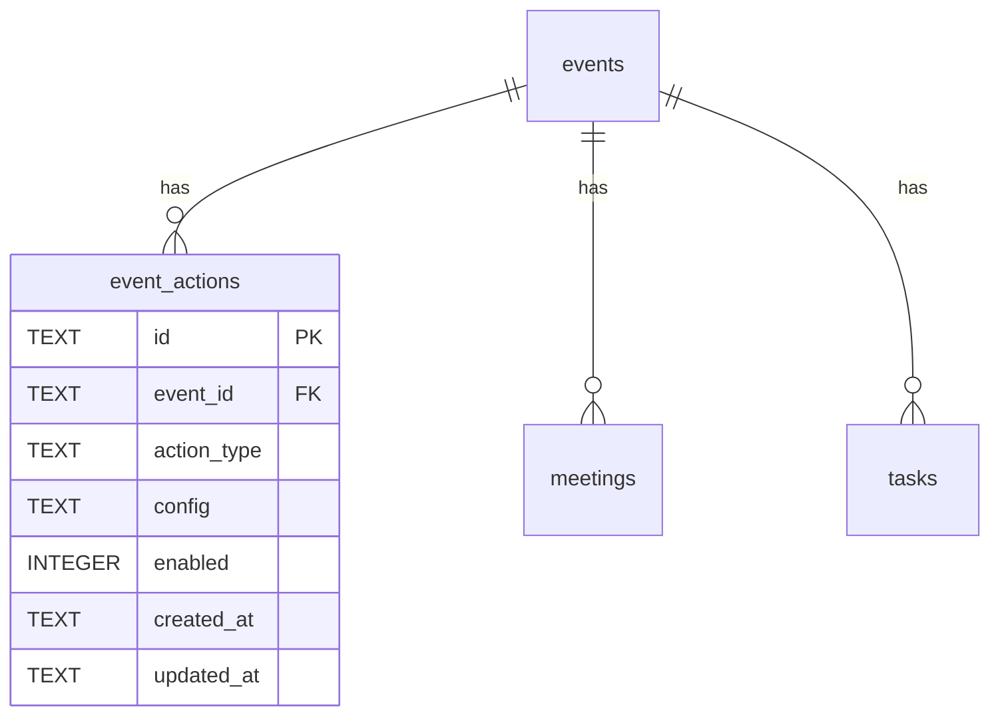

# ADR-0008: アクション概念の導入とイベント-アクション関係

- Status: Proposed
- Date: 2026-04-30

## Context

DevHub Ops は当初リーダー雑談会用の単一機能 Bot として開始したが、Sprint 1-9 を経て
複数イベント（リーダー雑談会 / HackIt / チーム開発）対応プラットフォームに発展した。

ここから更に「**Bot を構築・管理するプラットフォーム**」へと位置付けを進化させる:

- 各イベントが必要なアクションを自由に組み合わせる
- 既存タスク管理 / 日程調整も「アクション」として再整理
- 新規アクション（新メンバー対応 / PR レビュー依頼一覧）を追加可能に
- 将来は Zapier 的にトリガー × アクションをノーコードで組み合わせ可

## Decision

### 1. アクション概念の導入

| 概念 | 意味 |
|---|---|
| **Event** | プロジェクト/コミュニティ単位（リーダー雑談会 / HackIt / チーム開発 / ...） |
| **Action** | Bot がそのイベントで実行する仕事の単位 |
| **関係** | event 1:N action（1つのイベントに複数アクション） |

### 2. event_actions テーブル新設

| 列 | 型 | 説明 |
|---|---|---|
| id | TEXT PK | UUID |
| event_id | TEXT NOT NULL | events.id への FK |
| action_type | TEXT NOT NULL | `schedule_polling` / `task_management` / `member_welcome` / `pr_review_list` |
| config | TEXT NOT NULL DEFAULT `'{}'` | アクション固有設定（JSON） |
| enabled | INTEGER NOT NULL DEFAULT 1 | 0/1 |
| created_at | TEXT NOT NULL | UTC ISO |
| updated_at | TEXT NOT NULL | UTC ISO |
| UNIQUE | (event_id, action_type) | 同じイベントに同じアクションを重複登録不可 |

### 3. 既存 events タイプ拡張

既存 `events.type` は `'meetup' | 'hackathon'` のみ。これに **`'project'` を追加**（チーム開発用）。
type は実質「ラベル」となり、機能挙動は `event_actions` が決める。

### 4. UI 構造改修

既存 `/events/:eventId/:tab` のタブ構成を以下に変更:

| タブ | 内容 |
|---|---|
| 各アクションタブ | 有効化されたアクションごと（schedule / tasks / member_welcome / pr_review） |
| `actions` | アクションの登録・有効化・無効化・削除（管理画面） |
| `members` | メンバー一覧（共通） |
| `history` | 履歴（共通） |

タブ動的生成: `TABS_BY_TYPE` は廃止、実行時に `event_actions` を読んでタブ決定。

### 5. アクション type ごとの責務

```
schedule_polling:
  config: { meetingChannelId, candidateRule, ... } など既存仕様
  既存 polls / poll_options / poll_votes / scheduled_jobs を利用
  実装場所: 既存 src/services/poll.ts 等

task_management:
  config: { taskBoardChannelId?, defaultPriority?, ... }
  既存 tasks / task_assignees / sticky-task-board を利用
  実装場所: 既存 src/services/sticky-task-board.ts 等

member_welcome:
  config: { triggerChannelId, inviteChannelIds: string[], welcomeMessageTemplate }
  新規 src/services/member-welcome.ts 実装
  Slack member_joined_channel イベントに反応して招待 + 案内メッセージ送信

pr_review_list:
  config: { stickyChannelId, reviewerSlackIds?: string[] }
  新規 src/services/pr-review.ts 実装
  /devhub review add コマンド or sticky board で管理
  task_management の sticky bot 基盤を流用
```

### 6. データ移行（既存 events に default actions 自動投入）

| 既存 event | 自動投入するアクション |
|---|---|
| リーダー雑談会 (type=meetup) | `schedule_polling` |
| HackIt 2026 (type=hackathon) | `task_management` |

config はデフォルト値で投入。既存運用との整合は保たれる。

### 7. ER図



## Alternatives Considered

- **案A**: `events.type` で完全分岐（現状）
  - 不採用: 拡張性低、type が増えるたびに UI 分岐コード増
- **案B（採用）**: `event_actions` テーブルでアクション独立管理
- **案C**: アクション単独 entity、events 不要
  - 不採用: kota 指示で「event ごとに action がひも付く」ため
- **案D**: `events.config` JSON にアクション配列を持つ
  - 不採用: 個別 CRUD / UNIQUE 制約 / インデックスが効きにくい

## Consequences

### 良い点

- 拡張性: 新アクション追加が型追加 + テーブル登録だけで済む
- 既存機能と並行開発可（既存はそのまま、アクション追加 = 機能追加）
- 将来のノーコード組み合わせの基盤になる
- イベントごとの機能セット差別化が UI レベルで明示的

### 悪い点

- `event_actions` の管理 UI が増える
- 既存 `events.type='meetup'/'hackathon'` とアクション type のマッピングが必要（移行）
- `TABS_BY_TYPE` を捨てる影響で UI コード書き換え

### 影響を受ける既存実装

- `frontend/src/lib/eventTabs.ts`: 動的生成に書き換え
- `frontend/src/pages/EventTabPage.tsx`: `event_actions` 取得 + 動的タブ
- `src/db/schema.ts`: `event_actions` 追加
- `src/routes/api.ts`: `event_actions` CRUD 追加
- 既存 `schedule_polling` / `task_management` のロジックは変えない（ラップのみ）

## Migration plan summary

| Step | 内容 |
|---|---|
| 1 | ADR-0008 マージ |
| 2 | `event_actions` テーブル + マイグレーション 0015 |
| 3 | 既存 events に default action を自動投入する bootstrap (`ensureDefaultActions`) |
| 4 | `event_actions` API (GET/POST/PUT/DELETE) |
| 5 | UI: アクションタブ動的生成、actions 管理タブ追加 |
| 6 | 既存 schedule タブを `schedule_polling` アクションタブとして再ラップ |
| 7 | 既存 tasks タブを `task_management` アクションタブとして再ラップ |
| 8 | Sprint 11: `member_welcome` アクション実装 |
| 9 | Sprint 12: `pr_review_list` アクション実装 |
